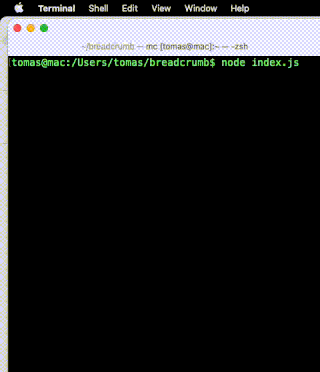

# 2D Video Game in AssemblyScript

A small demo 2D video game running in a web browser powered by WebAssembly.



*Disclaimer*: This was never intented to be a real game. The purpose is to demonstrate programming games from scratch in AssemblyScript. 

See the whole [tutotial on my blog](https://blog.ttulka.com/2d-video-game-in-assemblyscript-tutorial).

## Build

### Install package

```sh
npm install
```

### Compile to WebAssembly

```sh
npm run asbuild:optimized -- --memoryBase 40000
```

## Run
```sh
npx ws -p 1234
```

Open `http://127.0.0.1:1234` in a web browser.

## Play

Play online: https://ttulka.github.io/breadcrumblost/

Desktop only.

### Breadcrumb Lost

It is easy for children to follow breadcrumbs to get back home. But what about the poor breadcrumbs?!

Help a lost breadcrumb find its way home without getting wet or eaten.

#### Controls

- **UP** jump
- **RIGHT** go right
- **LEFT** go left

## Develop

### Convert images to AssemblyScript byte arrays

```sh
node image2array.js assets/image.png > assembly/image.ts
```

## Copyright

Assets taken from https://kenney.nl/assets/pixel-platformer
